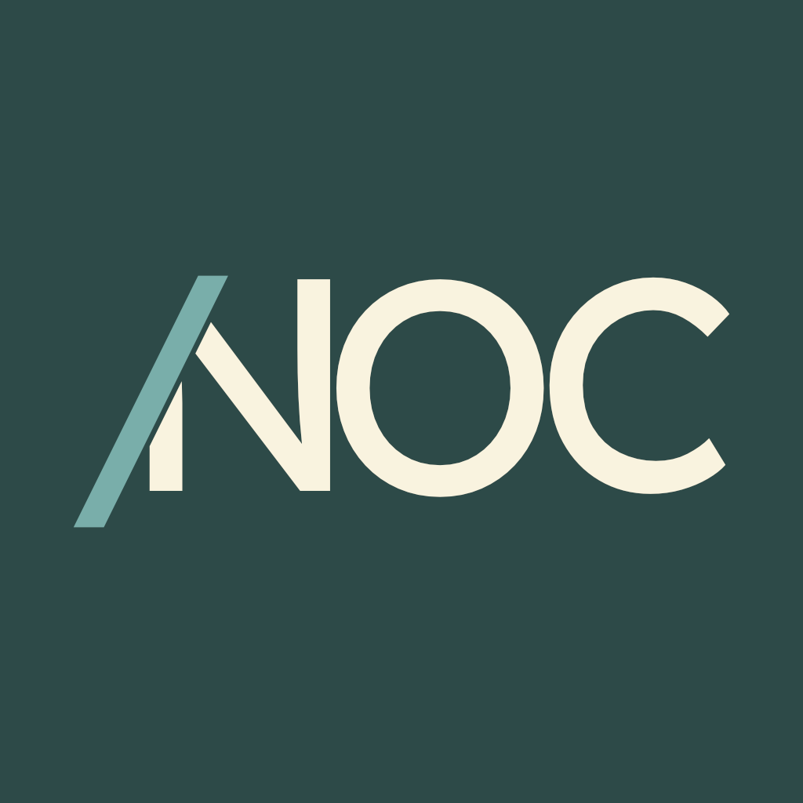

    
    <h1>NOC</h1>

The **NOC** is the official OcellusScript compiler. NOC is a Kotlin-implemented package that contains libraries, as well as executables for JVM and WebAssembly.

## Getting Started

### Requirements

- JDK v1.8

After cloning the OcellusScript repository, navigate to the `compiler` directory and then run `gradlew.bat build` if on Windows or `gradlew build` on macOS/Linux.

> Note: you may need to set the executable permission on `gradlew` if it doesn't exist already.

## Roadmap

This is the current roadmap for NOC:

- [X] Tokenizer
- [ ] Parser
- [ ] Symbol table generator
- [ ] JVM command line

## Found an issue?

Issues for NOC can be reported on YouTrack. [File a bug report &rsaquo;](https://youtrack.marquiskurt.net/youtrack/newIssue?project=NOC)