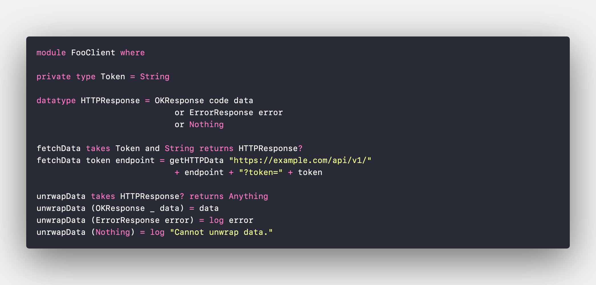

# OcellusScript

## A Haskell-inspired functional programming language

OcellusScript is a simple functional programming language, originally designed to work hand-in-hand with the coding mini game from the [Unscripted visual novel](https://unscripted.marquiskurt.net). It heavily draws inspiration and syntax from languages like Haskell, Swift, JavaScript/ES5, and Python. OcellusScript aims to be an easy-to-use, type safe, and powerful language.



## Quick start

!!! warning
    Efficacy is still being developed and cannot be installed from PyPI yet. You can still [download the source code](https://github.com/alicerunsonfedora/ocellusscript) and build it yourself to try it out. More information on the progress of Efficacy can be read on the [current progress](./progress.md#efficacy) page.

To get started with writing OcellusScript code, install the Efficacy tools using pip:

```
pip install efficacy
```

To try compiling an example, download an [example file](https://github.com/alicerunsonfedora/ocellusscript/tree/master/examples) and run the compiler:

```
efficacy -i <filename>.ocls -o example
```